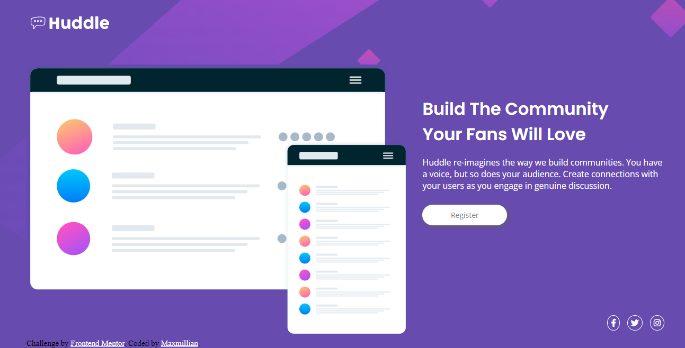

# Frontend Mentor - Huddle landing page with single introductory section solution

This is a solution to the [Huddle landing page with single introductory section challenge on Frontend Mentor](https://www.frontendmentor.io/challenges/huddle-landing-page-with-a-single-introductory-section-B_2Wvxgi0). Frontend Mentor challenges help you improve your coding skills by building realistic projects. 

## Table of contents

- [Overview](#overview)
  - [The challenge](#the-challenge)
  - [Screenshot](#screenshot)
  - [Links](#links)
- [My process](#my-process)
  - [Built with](#built-with)
  - [What I learned](#what-i-learned)
  - [Continued development](#continued-development)
  - [Useful resources](#useful-resources)
- [Author](#author)

## Overview

### The challenge

Users should be able to:

- View the optimal layout for the page depending on their device's screen size
- See hover states for all interactive elements on the page

### Screenshot



### Links

- Solution URL: [Add solution URL here](https://your-solution-url.com)
- Live Site URL: [Add live site URL here](https://your-live-site-url.com)

## My process

### Built with

- Semantic HTML5 markup
- CSS custom properties
- Flexbox
- Mobile-first workflow
- [Google Fonts](https://fonts.google.com/) - Font Library
- [Font Awesome 5 Fonts](https://fontawesome.com/) - Icon Library

### What I learned

- When using media queries, make sure to set the max-width to something more inclusive for all ranges of devices
- Always specify language at the header of your html code
- Use 'Alt' attribute with images 
- Semantic html is good but plain divs are too!
- When using Flex-basis, make sure any image in it has a width of 100%
- Apply background-colors to the body tag if it's going to take up the entire space of the web page

```css
  Some CSS code I'm proud of
    .container{
    margin-left: 50px;
    margin-right: 50px;
    display: flex;
    flex-wrap: wrap;
  }
  .col-1{
    flex-basis: 60%;
  }
  .col-1 img{
    width: 100%;
  }
  .col-2{
    flex-basis: 40%;
  }
```

### Continued development

- Improve my skills in Flexbox
- Improve my skills in mobile first design

### Useful resources

- [W3Schools](https://www.w3schools.com//) - This helped me to find out what values certain selectors took. I really it's easy to understand concept definitions and will use it going forward.

## Author

- Website - [Maxmillian Ogubabor](https://max-kolbe.maximilianogbua.repl.co/a)
- Twitter - [@ThatOne_GuyI](https://www.twitter.com/ThatOne_GuyI)

